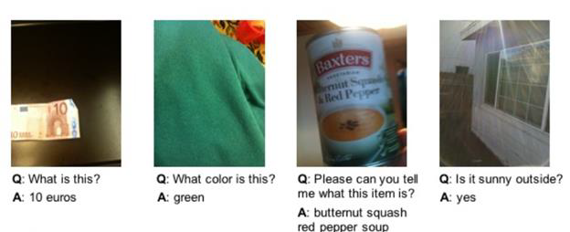
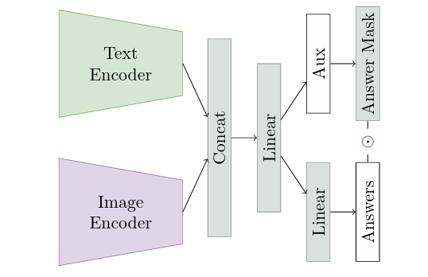
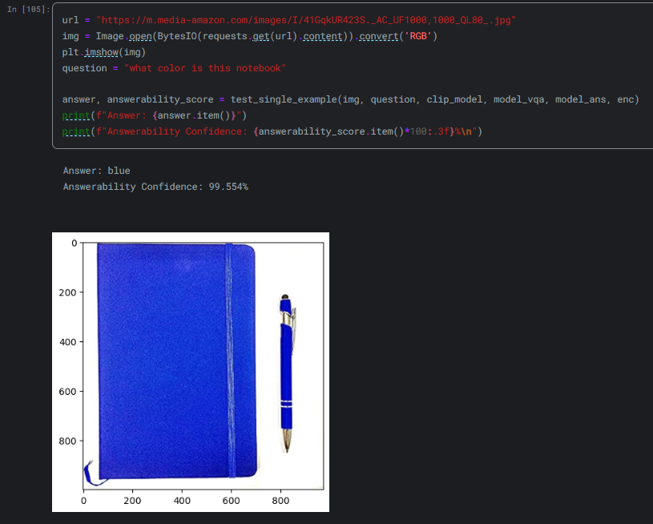

# VizWiz Visual Question Answering

This project is a replication of the paper [Less Is More: Linear Layers on CLIP Features as Powerful VizWiz Model](https://arxiv.org/abs/2206.05281), which uses OpenAI's [CLIP](https://github.com/openai/CLIP) model (without fine-tuning) as a feature extractor, along with a linear layer, to attempt the VizWiz Visual Question Answering and Answerability Challenges.

The dataset can be found here: [VizWiz](https://www.kaggle.com/datasets/ingbiodanielh/vizwiz/data), along with the [Kaggle notebook](https://www.kaggle.com/code/mohesmail143/vizwiz-visual-question-answering) used in the attempt.

This project was developed as part of the course Pattern Recognition in the Spring 2023 semester at the Faculty of Engineering, Alexandria University, under the Computer and Communications Engineering department, supervised by Dr. Marwan Torki.

## Steps

1- Examine the VizWiz dataset.



2- Build the model.



3- Evaluate the accuracy of the model according to the metrics defined by the competition.

4- Try your own example



## Prerequisites

This project was developed in the following environment:

- Jupyter Notebook
- Miniconda
- Python 3.11.5
- PyTorch

## Installing

1- Clone the repository to your local machine:

```bash
git clone https://github.com/MohEsmail143/vizwiz-visual-question-answering.git
```

2- Open Jupyter notebook.

3- Check out the the Jupyter notebook `visual-question-answering.ipynb`.

## License

This project is licensed under the MIT License - see the [LICENSE.md](LICENSE) file for details.
